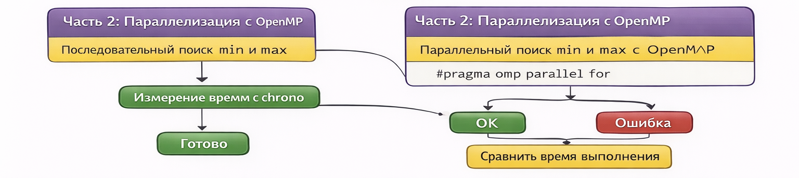
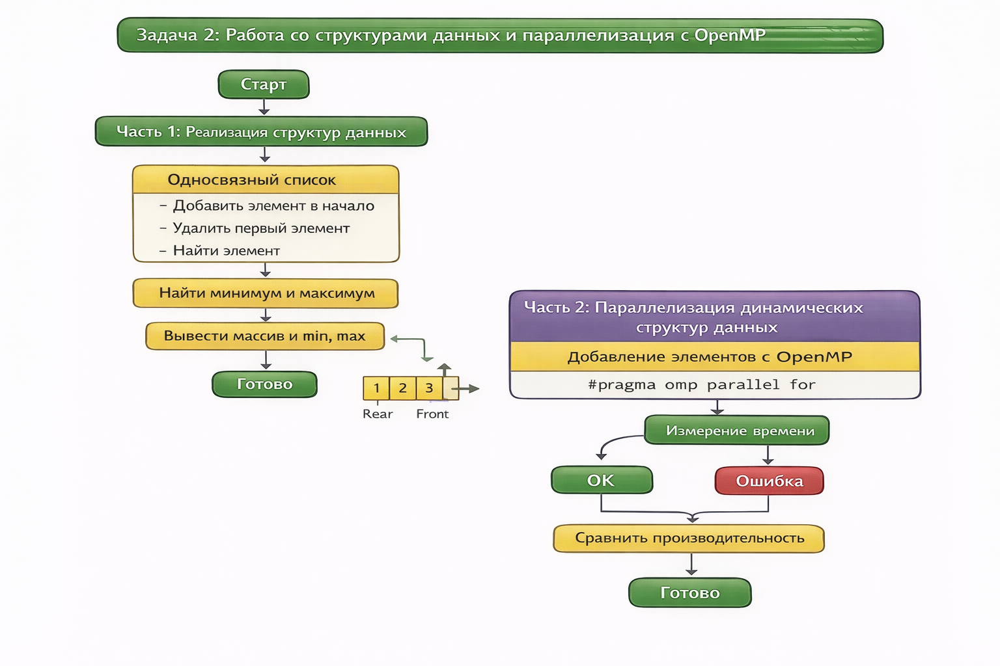
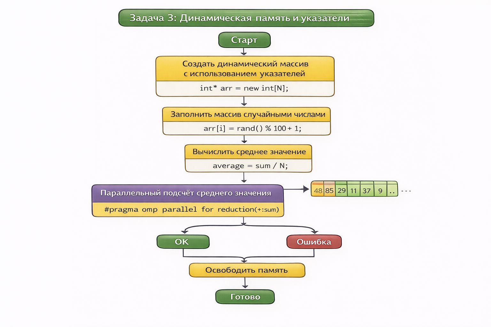

# Практическая работа 1 

## Часть 1: Работа с массивами

### Задание 1: Создание массива и поиск максимума и минимума

Создана программа, которая создаёт массив из N элементов, заполняет его случайными числами от 1 до 100, находит минимальные и максимальные элементы массива, а затем выводит сам массив и найденные значения.

1. Программа запрашивает размер массива у пользователя и создает динамический массив.
2. Массив заполняется случайными числами от 1 до 100.
3. Затем программа находит минимальные и максимальные значения массива, используя обычный перебор элементов массива.
4. В конце программа выводит сам массив, минимальное и максимальное значения.

**Результат работы программы:**

### Задание 2: Параллелизация с использованием OpenMP

Добавлено параллельное выполнение с использованием OpenMP для нахождения максимума и минимума в массиве и сравнить время выполнения параллельной и последовательной реализации.

1. Для параллельного поиска минимального и максимального значения в массиве используется директива `#pragma omp parallel for`. Она позволяет разделить задачу между несколькими потоками, ускоряя обработку массива.
2. Время выполнения параллельной и последовательной версий замеряется с использованием библиотеки `<chrono>`.
3. Результаты выводятся на экран для сравнения времени выполнения.

**Результат работы программы:**

## Часть 2: Работа со структурами данных

### Задание 1: Реализация односвязного списка, стека и очереди

Реализовано три структуры данных: односвязный список, стек и очередь, а также реализовать для них базовые операции.

1. **Односвязный список**:
   - Реализована функция для добавления элемента в начало, удаления первого элемента и поиска элемента по значению.
   
2. **Стек**:
   - Реализованы функции для добавления элемента в стек (push), удаления элемента из стека (pop) и проверки, пуст ли стек (isEmpty).

3. **Очередь**:
   - Реализованы функции для добавления элемента в конец очереди (enqueue), удаления из начала очереди (dequeue) и проверки на пустоту (isEmpty).

**Результат работы программы:**

## Часть 3: Динамическая память и указатели

### Задание 1: Создание динамического массива с помощью указателей

Создан динамический массив с помощью указателей и заполнить его случайными числами.

1. Массив создается с использованием оператора `new`, что позволяет выделить память динамически.
2. Массив заполняется случайными числами от 1 до 100.
3. Программа выводит массив на экран.

**Результат работы программы:**

### Задание 2: Параллельный подсчёт среднего значения

Использован OpenMP для параллельного подсчёта суммы элементов и вычисления среднего значения.

1. Программа использует директиву `#pragma omp parallel for reduction(+:sum)` для параллельного суммирования элементов массива.
2. После того, как сумма всех элементов вычислена, программа вычисляет среднее значение.
3. Результат выводится на экран.

**Результат работы программы:**

## Контрольные вопросы

1. **В чём основные отличия между массивами и динамическими структурами данных?**

   - **Массивы**: имеют фиксированный размер, который задаётся при их создании, и его нельзя изменить после этого. Они используют непрерывный участок памяти для хранения данных.
   - **Динамические структуры данных**: такие как односвязные списки, стеки и очереди, могут изменять свой размер во время выполнения программы, так как элементы динамически добавляются или удаляются, используя указатели для связи элементов.

2. **Что такое указатель, и как он используется в языке C++?**

   - **Указатель** — это переменная, которая хранит адрес другой переменной в памяти. Указатели в C++ используются для динамического выделения памяти, работы с массивами и структурами данных, а также для передачи параметров в функции по ссылке.

3. **Объясните принцип работы стека и очереди.**

   - **Стек** — это структура данных, работающая по принципу "последний зашел — первый вышел" (LIFO). Элементы добавляются в конец стека и удаляются с конца.
   - **Очередь** — это структура данных, работающая по принципу "первый зашел — первый вышел" (FIFO). Элементы добавляются в конец очереди и удаляются с начала.

4. **Каковы преимущества и недостатки односвязных списков по сравнению с массивами?**

   - **Преимущества**:
     - Односвязные списки могут динамически изменять размер в отличие от массивов.
     - Эффективное добавление и удаление элементов в любом месте списка.
   - **Недостатки**:
     - Доступ к элементам списка осуществляется последовательно, что делает его менее эффективным для случайного доступа.
     - Память для хранения указателей на следующий элемент требует дополнительных затрат.

5. **Как правильно освобождать память в языке C++ после работы с динамическими структурами?**

   - В языке C++ память, выделенную с помощью оператора `new`, необходимо освобождать с помощью оператора `delete`. Например, для массива `delete[] ptr` для динамического массива и `delete ptr` для одиночного объекта.

6. **Почему важно понимать работу с указателями и динамической памятью для параллельного программирования?**

   - В параллельном программировании важно правильно управлять памятью для каждого потока. Понимание работы с указателями и динамической памятью позволяет эффективно управлять ресурсами и предотвращать проблемы, такие как утечки памяти или неправильное распределение памяти между потоками.

7. **Как использовать reduction в OpenMP для нахождения суммы, минимума или максимума в массиве?**

   - В OpenMP директива `reduction` используется для вычисления операцій, таких как сумма, минимум или максимум, в параллельных вычислениях. При использовании `reduction(+:sum)` для суммы или `reduction(max:max_value)` для нахождения максимального значения, каждый поток будет иметь локальную копию переменной, а затем результаты будут корректно объединены.

8. **Как влияет параллельное программирование на производительность при работе с большими массивами?**

   - Параллельное программирование может значительно ускорить обработку больших массивов, особенно когда операции независимы. Однако накладные расходы на создание и управление потоками могут снизить производительность при работе с малыми массивами. На больших данных параллелизация позволяет значительно сократить время выполнения операций.

## Заключение

В ходе выполнения работы были реализованы основные операции с массивами, структурами данных и динамической памятью. Также была использована параллельная обработка данных с использованием OpenMP, что позволило значительно улучшить производительность на больших объемах данных.

