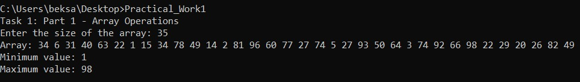
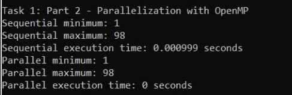
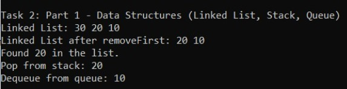
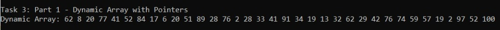
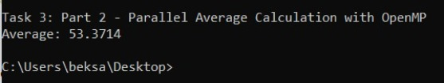

# Практическая работа по C++

## Введение

В рамках этой практической работы была реализована программа на C++, которая решает задачи, связанные с массивами, структурами данных и динамической памятью. В некоторых частях работы была использована параллелизация с помощью OpenMP для ускорения вычислений, а также динамическое выделение памяти с помощью указателей.

## Часть 1: Работа с массивами

### Задание 1: Создание массива и поиск максимума и минимума

**Цель:** Создать программу, которая создаёт массив из N элементов, заполняет его случайными числами от 1 до 100, находит минимальные и максимальные элементы массива, а затем выводит сам массив и найденные значения.

**Шаги выполнения:**
1. Создан динамический массив, для которого размер задается пользователем.
2. Массив заполняется случайными числами от 1 до 100 с использованием стандартной функции `rand()` и функции `srand(time(0))` для инициализации генератора случайных чисел.
3. Для нахождения минимального и максимального значения в массиве программа проходит по всем его элементам, сравнивая каждый элемент с текущими минимальными и максимальными значениями.
4. В конце программа выводит сам массив, минимальное и максимальное значения.

**Результат работы программы:**

 

### Задание 2: Параллелизация с использованием OpenMP

**Цель:** Добавить параллельное выполнение с использованием OpenMP для нахождения максимума и минимума в массиве и сравнить время выполнения параллельной и последовательной реализации.

**Шаги выполнения:**
1. Создан массив, как и в предыдущем задании, заполняя его случайными числами.
2. Для параллельного нахождения максимума и минимума в массиве добавлена директива OpenMP `#pragma omp parallel for`. Это позволяет параллельно обрабатывать разные части массива с использованием нескольких потоков.
3. Для сравнения времени выполнения параллельной и последовательной реализации использована библиотека `<chrono>`. Время выполнения обеих версий программы было замерено и сравнено.

**Результат работы программы:**

 

## Часть 2: Работа со структурами данных

### Задание 1: Реализация односвязного списка, стека и очереди

**Цель:** Реализовать три структуры данных: односвязный список, стек и очередь, а также реализовать для них базовые операции.

**Шаги выполнения:**
1. Для **односвязного списка** реализованы функции для добавления элемента в начало, удаления первого элемента и поиска элемента по значению.
2. Для **стека** реализованы функции `push`, `pop` и проверка на пустоту с помощью функции `isEmpty`.
3. Для **очереди** реализованы функции для добавления в конец, удаления из начала и проверки на пустоту.

**Результат работы программы:**

 

### Задание 2: Параллельная работа с динамическими структурами данных

**Цель:** Использовать OpenMP для параллельного добавления элементов в динамические структуры данных, такие как список и очередь, и сравнить производительность.

**Шаги выполнения:**
1. Созданы односвязный список и очередь.
2. Для параллельного добавления нескольких элементов в эти структуры данных использована директива `#pragma omp parallel for`. Это позволяет добавлять элементы одновременно в несколько частей структуры.
3. Сравнивалась производительность параллельного и последовательного добавления элементов.

**Результат работы программы:**

- Параллельное добавление элементов значительно ускоряет процесс при увеличении объема данных.

 

## Часть 3: Динамическая память и указатели

### Задание 1: Создание динамического массива с помощью указателей

**Цель:** Создать динамический массив с помощью указателей и заполнить его случайными числами.

**Шаги выполнения:**
1. Создан динамический массив с использованием оператора `new`.
2. Массив заполняется случайными числами от 1 до 100 с помощью функции `rand()`.

**Результат работы программы:**

 
## Контрольные вопросы

1. **В чём основные отличия между массивами и динамическими структурами данных?**

   - **Массивы**: имеют фиксированный размер, который задаётся при их создании, и его нельзя изменить после этого. Они используют непрерывный участок памяти для хранения данных.
   - **Динамические структуры данных**: такие как односвязные списки, стеки и очереди, могут изменять свой размер во время выполнения программы, так как элементы динамически добавляются или удаляются, используя указатели для связи элементов.

2. **Что такое указатель, и как он используется в языке C++?**

   - **Указатель** — это переменная, которая хранит адрес другой переменной в памяти. Указатели в C++ используются для динамического выделения памяти, работы с массивами и структурами данных, а также для передачи параметров в функции по ссылке.

3. **Объясните принцип работы стека и очереди.**

   - **Стек** — это структура данных, работающая по принципу "последний зашел — первый вышел" (LIFO). Элементы добавляются в конец стека и удаляются с конца.
   - **Очередь** — это структура данных, работающая по принципу "первый зашел — первый вышел" (FIFO). Элементы добавляются в конец очереди и удаляются с начала.

4. **Каковы преимущества и недостатки односвязных списков по сравнению с массивами?**

   - **Преимущества**:
     - Односвязные списки могут динамически изменять размер в отличие от массивов.
     - Эффективное добавление и удаление элементов в любом месте списка.
   - **Недостатки**:
     - Доступ к элементам списка осуществляется последовательно, что делает его менее эффективным для случайного доступа.
     - Память для хранения указателей на следующий элемент требует дополнительных затрат.

5. **Как правильно освобождать память в языке C++ после работы с динамическими структурами?**

   - В языке C++ память, выделенную с помощью оператора `new`, необходимо освобождать с помощью оператора `delete`. Например, для массива `delete[] ptr` для динамического массива и `delete ptr` для одиночного объекта.

6. **Почему важно понимать работу с указателями и динамической памятью для параллельного программирования?**

   - В параллельном программировании важно правильно управлять памятью для каждого потока. Понимание работы с указателями и динамической памятью позволяет эффективно управлять ресурсами и предотвращать проблемы, такие как утечки памяти или неправильное распределение памяти между потоками.

7. **Как использовать reduction в OpenMP для нахождения суммы, минимума или максимума в массиве?**

   - В OpenMP директива `reduction` используется для вычисления операцій, таких как сумма, минимум или максимум, в параллельных вычислениях. При использовании `reduction(+:sum)` для суммы или `reduction(max:max_value)` для нахождения максимального значения, каждый поток будет иметь локальную копию переменной, а затем результаты будут корректно объединены.

8. **Как влияет параллельное программирование на производительность при работе с большими массивами?**

   - Параллельное программирование может значительно ускорить обработку больших массивов, особенно когда операции независимы. Однако накладные расходы на создание и управление потоками могут снизить производительность при работе с малыми массивами. На больших данных параллелизация позволяет значительно сократить время выполнения операций.

## Заключение

В ходе выполнения работы были реализованы основные операции с массивами, структурами данных и динамической памятью. Также была использована параллельная обработка данных с использованием OpenMP, что позволило значительно улучшить производительность на больших объемах данных.

